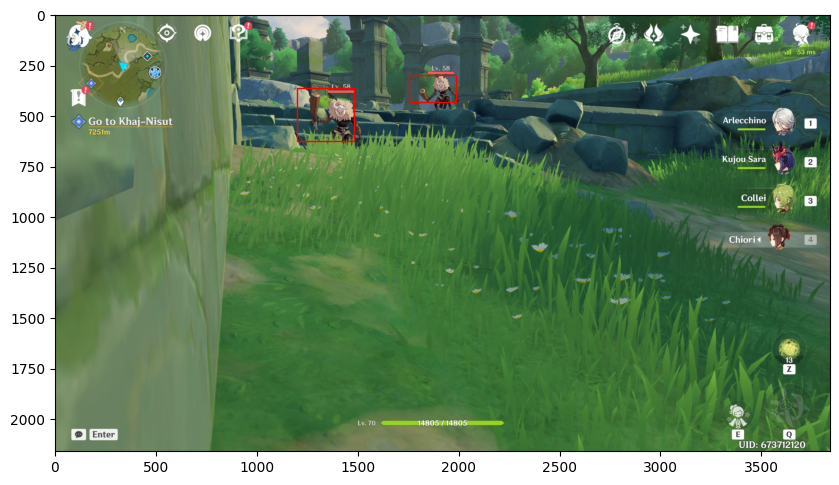

# Hilichurl Detection with Machine-Learning
A tutorial on object detection using convolutional neural networks by [Alshival's Data Service](https://alshival.com).

We construct a model for detecting Hilichurls. 

The substack for this project can be found here: [The Data Team](https://open.substack.com/pub/alshival/p/hilichurl-detection-with-machine?r=2e5awl&utm_campaign=post&utm_medium=web&showWelcomeOnShare=true)

